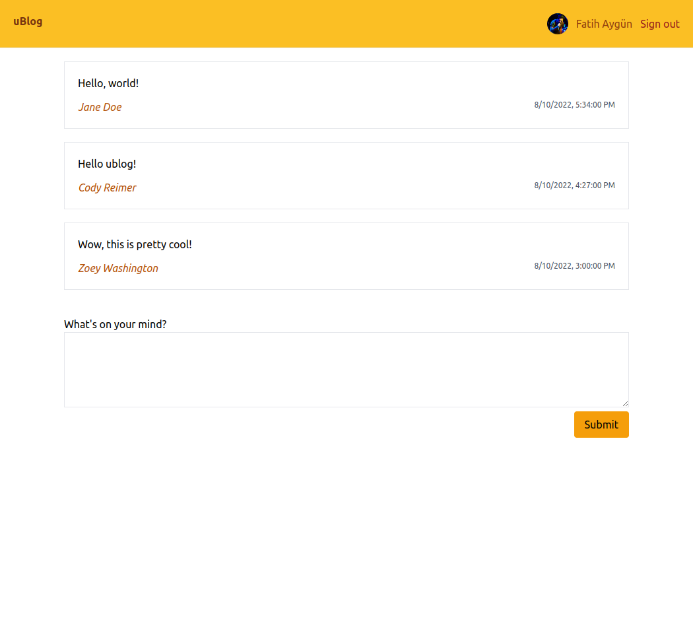

# Part 6: Styling with UnoCSS

Rakkas [supports](https://rakkasjs.org/guide/styling) all styling options available to React apps. Since we're building an app with cutting-edge technologies, I think it would be fitting to use some of the latest and greatest styling options. [Tailwind CSS](https://tailwindcss.com) seems to be the coolest kid in town nowadays. But we'll go even further and use [UnoCSS](https://github.com/unocss/unocss). It's a [reimagining](https://antfu.me/posts/reimagine-atomic-css) of atomic CSS with an instant on-demand approach that **is 200x faster** than Tailwind JIT! Let's start by installing the required packages:

```bash
npm install -D unocss @unocss/reset
```

`unocss` is the main package and `@unocss/reset` provides a collection of CSS resets, including the Tailwind CSS "Preflight", an opinionated set of base styles for Tailwind.

Following the UnoCSS readme, we add to our `vite.config.ts` file `import Unocss from "unocss/vite";` and then add `UnoCSS()` the the `plugins` array:

```ts
import { defineConfig } from "vite";
import rakkas from "rakkasjs/vite-plugin";
import tsconfigPaths from "vite-tsconfig-paths";
import Unocss from "unocss/vite";
import dotenv from "dotenv";

dotenv.config();

export default defineConfig({
	envDir: ".",
	plugins: [
		tsconfigPaths(),
		rakkas({
			adapter: "cloudflare-workers",
		}),
		Unocss(),
	],
});
```

We also add the following imports at the top of our `src/routes/layout.tsx`:

```ts
import "@unocss/reset/tailwind.css";
import "uno.css";
```

ESLint will complain about not being able to resolve `uno.css`. You can shut it up by adding the following to your `.eslintrc.cjs` file:

```js
	// ...
	rules: {
		"import/no-unresolved": ["error", { ignore: ["uno.css"] }],
	},
};
```

If you spin up the dev server, you'll see that our app is now completely unstyled. UnoCSS allows us to style our app with class names. Its default preset supports many atomic/functional CSS libraries all at once: `ml-3` (Tailwind), `ms-2` (Bootstrap), `ma4` (Tachyons), and `mt-10px` (Windi CSS) are all valid.

<!-- prettier-ignore -->
```css
.ma4 { margin: 1rem; }
.ml-3 { margin-left: 0.75rem; }
.ms-2 { margin-inline-start: 0.5rem; }
.mt-10px { margin-top: 10px; }
```

I will start by removing the `<hr />` element and add some color, padding and a bottom border to our header:

```tsx
<header className="px-5 py-5 b-b bg-amber">
```

`px` is shorthand for horizontal padding and `py` is shorthand for vertical padding. `b-b` is shorthand for a bottom border. `bg-amber` is for setting the background color to amber. You can learn more on the [UnoCSS website](https://uno.antfu.me/).

I'm sure everyone reading this article is better at designing a good-looking website than I am. Here's what I could come up with after half an hour of tinkering:



It may not be great but I'm happy with the result. I did change the markup as I've seen fit. I also added a `Head` component to set the page title in `index.page.tsx` (`<Head title="uBlog" />`). You can see the results [here](https://ublog.rakkasjs.workers.dev/).

## Conclusion

I hope you enjoyed this tutorial series and also hope that you find Rakkas as easy to work with as I think it is. You can extend this little app by adding user profile pages, post deletion functionality, pagination, and more. Feel free to say hi on [Rakkas Discord](https://rakkasjs.org/chat) chat server!

> You can find the progress up to this point on [GitHub](https://github.com/rakkasjs/ublog/tree/article-6).
